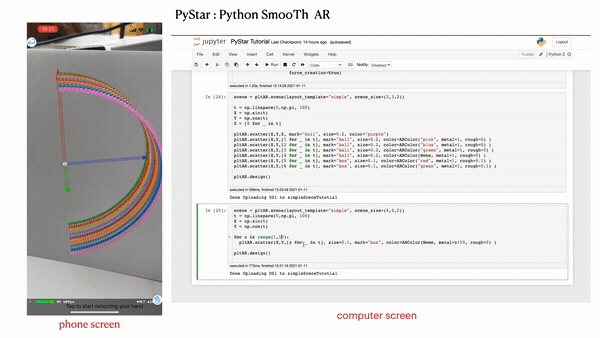

# PyStar: Realtime Augmented Reality Data Visualization in iOS.

PyStar stands for: Python SmooTh Augmented Reality

Companion iOS App: [Augmented Data](https://apps.apple.com/jp/app/augmented-data-ar-data/id1510366704)